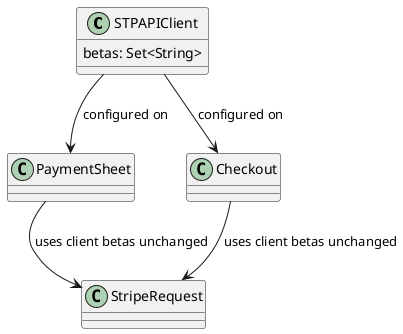
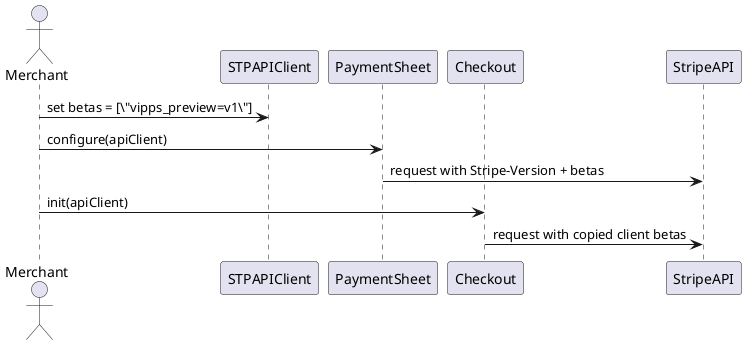

# API Review: Public `STPAPIClient.betas` for Vipps beta opt-in

*Note for submitters: please don’t fiddle with the slugs marked with {{}} - we use those for automated search+replace to pipe in data from the tooling at go/ask/api-review. Please reach out to #api-review if you have any questions.*

| {{resolution date}} {{*the reviewer will insert the [review outcome](https://docs.google.com/document/d/19ukqb5OgEIFX_7IZ4ijsgA4Czo0hiuHFGw9kQMLCjo4/edit#heading=h.h8oe2ag9wops) here}}* |
| :---- |

**JIRA:** {{jira}}  
**BRB**: {{brb url}}  
**Review submitter:** {{review submitter}}  
**Responsible PM:** <@xxx responsible PM for the review>  
**Submission date**: {{submission date}}

# RAPID

| Recommend | Agree | Perform | Input | Decide |
| :---- | :---- | :---- | :---- | :---- |
| **Author:** {{review submitter}} | **Reviewer 1:** {{DRI Reviewer}} **Reviewer 2:** {{Secondary Reviewer}} **Additional reviewers:** {{Additional Reviewers}} | n/a | **Other teams:** Mobile SDKs, Vipps | **EM owner:** <tbd> |

# Changelog

| Date | Change | Notes |
| :---- | :---- | :---- |
| 2026-07-08 | Initial draft | Public stripe-ios SDK surface only |

# Summary

This change makes Vipps preview opt-in explicit and merchant-owned by exposing `STPAPIClient.betas` as a public `Set<String>` on stripe-ios. It also removes SDK-owned auto-injection of `vipps_preview=v1` from PaymentSheet and Checkout so requests use only the beta headers the merchant supplies on their API client.

**Seeking approval for** Invite-only beta.

# Context

## Related documents

* Product shaping document / Project brief / PRD: n/a in this artifact
* Security review: n/a
* Public API documentation (reference and/or an integrator’s guide): pending release changelog entry in `stripe-ios/CHANGELOG.md`
* Previous API Review(s): none for this exact SDK surface

## Goals and non-goals

Goals:
* Give merchants one generic SDK-owned place to opt into preview headers.
* Remove hidden Vipps-specific behavior from PaymentSheet and Checkout.
* Preserve configured beta headers when `STPAPIClient` is copied.

Non-goals:
* No new Stripe HTTP API endpoint, request parameter, or response field.
* No Vipps-specific public enum, constant, or PaymentSheet-specific toggle.
* No change to non-Vipps request behavior unless the merchant explicitly sets beta headers.

## Affected teams and products

This change affects stripe-ios public SDK consumers who integrate PaymentSheet or Checkout and want to opt into the Vipps preview. The change is SDK-only and does not require backend API changes.

# 1️⃣ Foundation and concepts

## Domain model

Core concepts:
* `beta header`: raw Stripe-Version suffix such as `vipps_preview=v1`
* `API client beta set`: merchant-owned `Set<String>` stored on one `STPAPIClient`
* `request surface`: PaymentSheet or Checkout requests that inherit the beta set from the `STPAPIClient` they already use



## Sequence diagrams for new operations, objects and concepts



## Interoperability ( ‼️ new)

No Sigma, Tax, Revenue Recognition, or backend accounting interoperability impact. This is a client SDK header-propagation change only.

## Developer flows

Merchant wants to opt into Vipps preview explicitly and have that choice flow through all PaymentSheet / Checkout requests.

```swift
let apiClient = STPAPIClient(publishableKey: publishableKey)
apiClient.betas = ["vipps_preview=v1"]

var configuration = PaymentSheet.Configuration()
configuration.apiClient = apiClient

let paymentSheet = PaymentSheet(
    paymentIntentClientSecret: clientSecret,
    configuration: configuration
)
```

For Checkout:

```swift
let apiClient = STPAPIClient(publishableKey: publishableKey)
apiClient.betas = ["vipps_preview=v1"]

let checkout = try await Checkout(
    clientSecret: checkoutClientSecret,
    apiClient: apiClient
)
```

The SDK does not append `vipps_preview=v1` automatically. If the merchant does not set `apiClient.betas`, the SDK sends the default `Stripe-Version` only.

# 2️⃣ API Details [expand me]

This review covers a public stripe-ios SDK surface change. There is no Stripe HTTP API endpoint or response schema change.

**SDK schema**

```typescript
class STPAPIClient {
  // Merchant-supplied beta Stripe-Version suffixes.
  betas: Set<string>
}
```

## Validation and errors

No new Stripe API error shape. SDK behavior is additive: merchants may leave `betas` empty, or supply one or more raw beta strings.

## Webhooks

None.

## Sandboxes & Testmode

Existing Stripe testmode flows continue to work. Merchants test Vipps preview by setting `STPAPIClient.betas = ["vipps_preview=v1"]` in a test integration.

## Deprecation strategy, Backwards compatibility & Product interoperability

### **Deprecation strategy & Backwards compatibility**

This is additive at the stripe-ios public SDK surface, but it changes the integration contract for the Vipps preview because hidden SDK-owned auto-injection is removed. Merchants who relied on the hidden local behavior must now set `vipps_preview=v1` explicitly on the API client they pass into PaymentSheet or Checkout.

### **Product Interoperability**

No v1/v2 Stripe API interoperability impact. This change is isolated to stripe-ios client behavior.

## Performance & Reliability

No meaningful performance change. Reliability improves because all request surfaces now inherit one merchant-configured beta set instead of selectively mutating headers in PaymentSheet / Checkout paths.

## Documentation

Planned changelog wording:

* [Added] Added public `STPAPIClient.betas` support for merchant-supplied beta headers. To use Vipps in PaymentSheet beta, add `vipps_preview=v1`, for example `Set(["vipps_preview=v1"])`.

# 3️⃣ Alternatives considered

* Keep `betas` as `@_spi(STP)` and add a separate public property. Rejected because it duplicates semantics and still exposes raw beta-header ownership.
* Add a Vipps-specific public constant or PaymentSheet configuration flag. Rejected because preview headers should stay generic request metadata, not payment-method-specific SDK behavior.
* Keep auto-injecting `vipps_preview=v1` in PaymentSheet and Checkout. Rejected because it hides a merchant opt-in requirement and creates inconsistent ownership of preview behavior.

# Proposal discussion

This is a stripe-ios SDK-only public surface change. There is no corresponding Stripe HTTP API patch to submit for API Studio validation.
